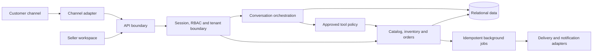

# Architecture

The private system is organized around explicit trust boundaries. This diagram
shows responsibilities without exposing production schemas, endpoints, account
identifiers, or deployment configuration.

## Boundary rules

1. A tenant identifier from a request is never trusted by itself. Active
   membership establishes tenant context before domain logic executes.
2. Repository filters add the established tenant scope again as defense in
   depth.
3. Prices, stock, delivery fees, totals, and order statuses are deterministic
   server facts.
4. Channel events and writes use idempotency keys so retries do not duplicate
   messages, orders, reservations, or jobs.
5. Conversation automation operates through an allowlist of tools and yields to
   a human when confidence or policy requirements are not met.

## Operational separation

HTTP request handling and scheduled/background work can run as separate roles.
The data store, queue, and channel gateway stay on internal networks, while a
reverse proxy terminates public HTTPS traffic.
